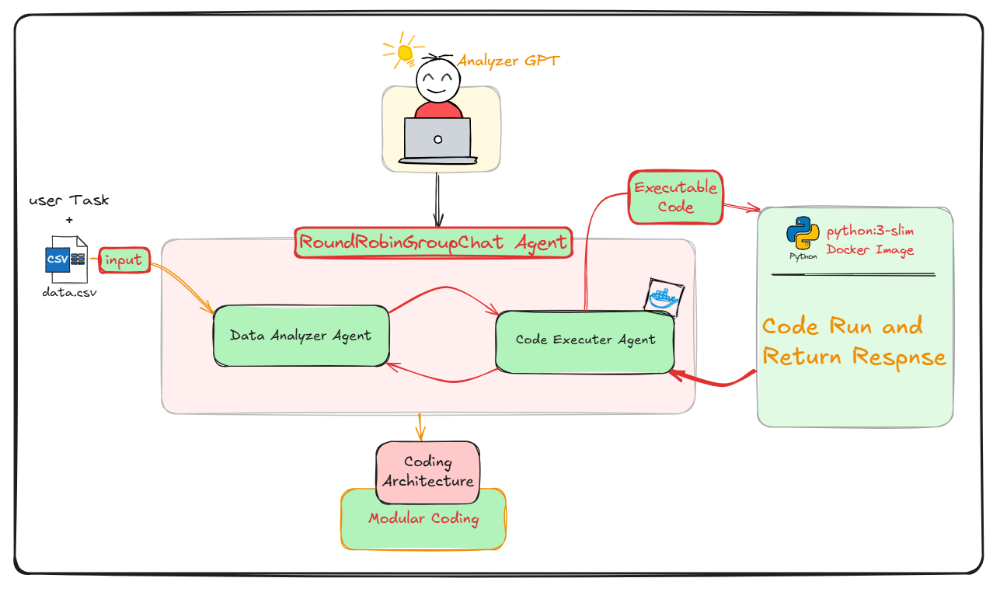
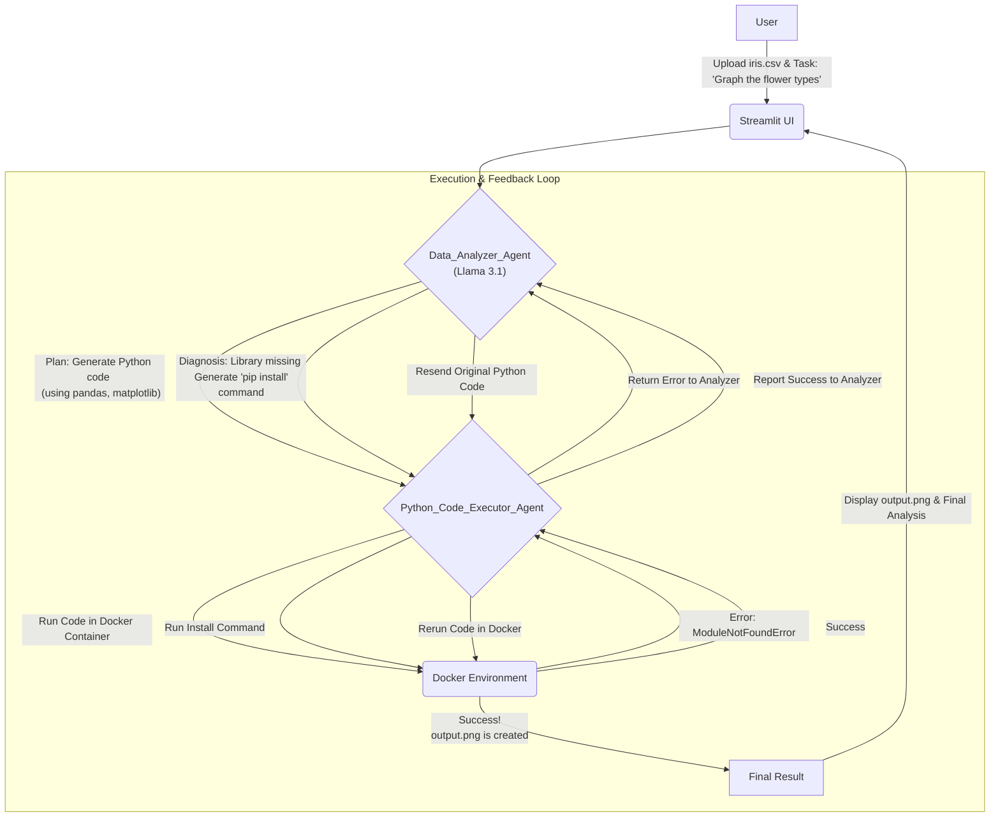

# Analyzer GPT: An Autonomous Data Analysis Agent 🚀

Analyzer GPT is a sophisticated multi-agent system that automates the entire data analysis workflow. Simply upload a dataset, provide a task in plain English, and watch as an AI agent writes, executes, and autonomously debugs Python code to deliver the final result.

This project moves beyond simple code generation. It creates a resilient, problem-solving loop where a Data Analyzer agent collaborates with a Code Executor agent. If the code fails due to a missing library or a syntax error, the agent analyzes the error and corrects itself, mimicking the iterative process of a human data analyst.

## ✨ Key Features

* 🤖 **Autonomous Workflow**: A `Data_Analyzer_Agent` understands natural language prompts, formulates a plan, and generates Python code for analysis.
* 🧠 **Self-Correction & Debugging**: If the code execution fails, the agent receives the full error traceback, diagnoses the issue (e.g., `ModuleNotFoundError`, `SyntaxError`), and generates corrective actions—either by installing missing libraries or rewriting the code.
* 🔐 **Secure & Isolated Execution**: All code is executed inside a Docker container using AutoGen's `DockerCommandLineCodeExecutor`, ensuring that the agent's operations are sandboxed and secure.
* 📊 **Rich Output Generation**: Capable of generating and saving data visualizations (e.g., charts, graphs as .png files), data summaries, and textual insights.
* 🌐 **Interactive UI**: A user-friendly web interface built with Streamlit allows for easy file uploads and real-time interaction with the agent team.
* 📦 **Modular Architecture**: The project is organized into logical modules for agents, configuration, and utilities, making it easy to understand, maintain, and extend.
* 💻 **Local First**: Runs with a locally hosted LLM (via Ollama), ensuring data privacy and cost-free operation.

## 🏗️ How It Works: The Agentic Architecture

The system is built on a collaborative multi-agent architecture powered by **Microsoft AutoGen**. The core workflow is a `RoundRobinGroupChat` between two specialist agents.



### Use code with caution.

#### Mermaid Workflow Summary

* **User Input**: The user uploads a CSV file and provides a task through the Streamlit interface.
* **Analysis & Planning**: The `Data_Analyzer_Agent`, powered by Llama 3.1, receives the task. It plans its approach and writes Python code to solve the problem.
* **Code Execution**: The code is passed to the `Python_Code_Executor_Agent`, which executes it within a secure Docker container.

##### The Feedback Loop:

* **On Success**: The output (e.g., a print statement, a saved image) is captured and the process moves forward.
* **On Failure**: The complete error message is sent back to the `Data_Analyzer_Agent`. The agent analyzes the error and decides on the next step:

  * If a library is missing, it sends a bash command to `pip install` the required packages.
  * If the code has a bug, it rewrites the Python script to fix it.

**Iteration**: This loop continues until the code executes successfully and the user's goal is met.

**Final Output**: Once the task is complete, the agent provides a final analysis and signals "STOP", terminating the process. The generated image is displayed in the Streamlit app.

## 🛠️ Tech Stack

* **Agent Framework**: Microsoft AutoGen
* **LLM Provider**: Ollama (running Llama 3.1)
* **Web Framework**: Streamlit
* **Code Execution**: Docker
* **Core Language**: Python

## 📂 Project Structure

```
01-analyser-GPT-Modular-architecture/
├── agents/                  # Definitions for the AutoGen agents
│   ├── code_executor_agent.py
│   └── data_analyser_agent.py
├── config/                  # Configuration files
│   ├── constants.py
│   └── docker_util.py
├── model/                   # LLM client setup
│   └── ollama_model_clint.py
├── prompts/                 # System messages and prompts for agents
│   └── data_analyzer_Smessages.py
├── teams/                   # Definition of the agent group/team
│   └── analyzer_gpt.py
├── temp/                    # Working directory for Docker, stores uploaded data and outputs
├── main.py                  # A command-line entry point for testing
├── streamlit_app.py         # The main Streamlit web application
└── requirements.txt         # Project dependencies
```

### Use code with caution.

## 🚀 Getting Started

Follow these steps to set up and run Analyzer GPT on your local machine.

### Prerequisites

* Python 3.8+
* Docker Desktop (Ensure the Docker engine is running)
* Ollama (Install and ensure it is running)

### Installation

Clone the repository:

```bash
git clone https://github.com/MDalamin5/End-to-End-Agentic-Ai-Automation-Lab
cd 07-End-To-End-Projects-Autogen
cd 01-analyser-GPT-Modular-architecture
```

Set up a Python virtual environment:

```bash
python -m venv venv
source venv/bin/activate  # On Windows: venv\Scripts\activate
```

Install the required dependencies:

```txt
# requirements.txt
pyautogen
streamlit
aiohttp
docker
```

```bash
pip install -r requirements.txt
```

Pull the LLM model via Ollama:

```bash
ollama pull llama3.1
```

### Running the Application

```bash
streamlit run streamlit_app.py
```

Then navigate to [http://localhost:8501](http://localhost:8501) in your browser.

Upload a CSV file, type your data analysis task into the chat box, and hit Enter!

## 🔮 Future Roadmap

* **Human-in-the-Loop (HITL)**: Add an approval step for user validation.
* **Long-Term Memory**: Use a vector DB to retain past interactions.
* **More Data Sources**: Extend support to SQL, APIs, and more.
* **Advanced Agent Skills**: Integrate tools like web search for external data.

## 🤝 Contributing

Contributions are welcome! Please open an issue to discuss any new features or bug fixes before submitting a pull request.

## 📄 License

This project is licensed under the MIT License. See the LICENSE file for details.
